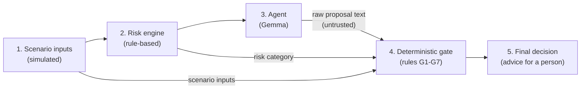

# AI-Driven Compound Risk Detection and Safety Decision Support System for Industrial Environments

**Review II prototype.** An early-stage academic prototype (roughly 20% of the planned system)
that demonstrates one complete, working end-to-end scenario for a simulated industrial area
called **Zone 4**.

> **Simulation only.** All inputs are simulated. The thresholds and rules are provisional
> values chosen for an academic demonstration. They are not validated or certified industrial
> safety rules. The system only gives advice and never connects to, or sends commands to,
> real equipment.

---

## What the prototype does

Serious industrial incidents often come from several conditions that each look minor on their
own but are dangerous together: for example, a slowly rising gas level, a failed extraction fan
and an open hot-work permit during a shift changeover. A single-sensor alarm set at 10% LEL would
not react to 4% LEL gas, even when everything else is going wrong.

This prototype:

1. lets you edit a **simulated Zone 4 scenario** (seven inputs, a Normal operation preset, a Reset button);
2. assesses it with a **transparent rule-based risk engine** that checks individual conditions
   *and* combinations of conditions, and explains which rules produced the result;
3. asks an **agent** (a local **Gemma** model) to propose one advisory action;
4. sends every proposal through a separate **deterministic decision gate** (shown on the page as the
   **Safety Check**) that accepts or rejects it using explicit rules;
5. shows the **final decision**. Every result is explained in plain language on the page.

The agent can only *propose*. It can never authorise a safety-critical action. The final decision
always comes from the gate.

## Workflow and architecture



Design points:

- **No path around the gate.** `pipeline.py` always calls the gate before a final decision exists.
- **The gate treats agent output as untrusted text.** It parses and validates the output itself
  and never guesses what a malformed proposal meant.
- **The risk category comes from the risk engine, never from the agent.** The gate also checks
  the scenario for missing inputs on its own, so it does not rely on another component.
- **Confidence is ignored.** The agent may report a confidence value. It is shown on the page,
  but no gate rule reads it.
- **Separated modules.** `agent.py` does not import `decision_gate.py`, and the gate's rules are not
  part of the agent's prompt. The agent is only given the list of advisory action names.
- **Rejection leads to a documented default.** When the gate rejects a proposal, it applies its
  own default response for the situation (for example, escalate to the shift supervisor for
  HIGH risk).

### How the modules interact (one analysis)

1. The browser (`frontend/app.js`) sends the form values to `POST /api/analyse`.
2. `backend/server.py` checks the request and calls `run_analysis()` in `backend/pipeline.py`.
3. `scenario.clean_scenario()` converts the inputs. Blank or invalid values become "not reported".
4. `risk_engine.assess_risk()` applies the risk rules and returns the category and findings.
5. `agent.get_proposal()` returns Gemma's raw output text.
6. `decision_gate.check_proposal()` checks that text against rules G1–G6 and decides
   (G7 means accepted).
7. The pipeline adds plain-language explanations and returns the result to the browser, which shows
   the five sections: Scenario Inputs, Risk Assessment, Agent Proposal, Safety Check, Final Decision.

## Project structure

```
IDP-Industrial Monitoring System/
├── api/
│   ├── config.py          Vercel serverless function for GET /api/config
│   └── analyse.py         Vercel serverless function for POST /api/analyse
├── backend/
│   ├── server.py          Web server (Python standard library) and JSON API
│   ├── pipeline.py        Runs Scenario -> Risk engine -> Agent -> Gate -> Final decision
│   ├── scenario.py        Zone 4 input fields, the Normal operation preset, input cleaning
│   ├── risk_engine.py     Rule-based risk engine (rules I1-I10, C1-C7, M1)
│   ├── agent.py           Gemma agent (via Ollama); fixed test responses for the tests
│   └── decision_gate.py   Deterministic decision gate (rules G1-G7) and action catalogue
├── frontend/
│   ├── index.html         Page layout
│   ├── style.css          Styling
│   └── app.js             Form handling, API calls, display of the five sections
├── tests/
│   ├── sample_scenarios.py    Example scenarios used by the tests
│   ├── test_risk_engine.py    Required test cases 1-4, plus risk engine checks
│   ├── test_decision_gate.py  Required test cases 5-10, plus gate independence checks
│   ├── test_pipeline.py       End-to-end workflow tests (and an optional live Gemma test)
│   ├── test_server.py         HTTP API tests against a real local server
│   └── test_vercel_api.py     Tests of the Vercel functions in api/
├── vercel.json            Vercel settings: serve frontend/, run api/*.py as Python functions
├── .vercelignore          Files Vercel does not need to upload
├── .gitignore
└── README.md
```

## Requirements

- **Python 3.9 or newer.** Tested with Python 3.9.6, 3.11.14 and 3.14.6 on macOS.
- A modern web browser.
- **No third-party Python packages and no database.** Everything uses the Python standard library.
- [Ollama](https://ollama.com) with the `gemma3:1b` model, for the agent proposals.

## Running the application

macOS / Linux:

```bash
cd "IDP-Industrial Monitoring System"
python3 backend/server.py
```

Windows (Command Prompt or PowerShell):

```
cd "IDP-Industrial Monitoring System"
py backend\server.py
```

Then open **http://127.0.0.1:8000** in a browser. Stop the server with `Ctrl+C`.

If port 8000 is already in use, choose another port:
`PORT=8001 python3 backend/server.py` (macOS/Linux) or
`$env:PORT=8001; py backend\server.py` (Windows PowerShell).

## The Gemma agent

The agent proposals come from a local Gemma model:

```bash
ollama pull gemma3:1b    # one-time download, about 815 MB
ollama serve             # not needed if the Ollama app is already running
```

Start (or reload) the prototype after Ollama is running. If Gemma is not available, the page shows a
short note. The analysis still runs: there is no agent proposal, so the Safety Check rejects the
empty proposal and the system uses its own safe default as the final decision.
To use another installed model, set `GEMMA_MODEL` (for example `GEMMA_MODEL=gemma3:4b`).
Requests use temperature 0 and a fixed seed, so answers are as repeatable as the model allows.

## Deploying to Vercel

The project is ready for Vercel with no build step and no extra packages:

- `frontend/` is served as the static website (`outputDirectory` in `vercel.json`).
- `api/config.py` and `api/analyse.py` run as Python serverless functions. They reuse the same
  request handler as the local server (`backend/server.py`), so there is only one copy of the logic.

Steps:

1. Push this folder to a GitHub repository.
2. In Vercel, choose **Add New → Project**, import the repository, and keep the default settings
   (Framework Preset: *Other*). `vercel.json` provides everything else.
3. Deploy. The page is served at the project URL, and the API at `/api/config` and `/api/analyse`.

**Gemma on Vercel.** Vercel's servers cannot run Ollama, so by default the hosted site has no
agent proposal: the page shows a short note, the Safety Check rejects the empty proposal, and the
system applies its own safe default. The risk assessment, safety check and final decision still
work. To use Gemma from the hosted site, run Ollama on a machine that the internet can reach
(for example through a secure tunnel) and set these environment variables in the Vercel project
settings:

| Variable | Example | Meaning |
|---|---|---|
| `OLLAMA_URL` | `https://your-ollama-host.example` | Address of a reachable Ollama server |
| `GEMMA_MODEL` | `gemma3:1b` | Model name installed on that server |

Only expose an Ollama server if you understand the security implications; it has no login of its own.

## Running the tests

From the project folder:

```bash
python3 -m unittest discover -s tests -v
```

(On Windows: `py -m unittest discover -s tests -v`.) No test framework needs to be installed.

| # | Required test case | Test |
|---|---|---|
| 1 | Normal scenario | `test_risk_engine.test_01_normal_scenario_is_low_risk` |
| 2 | Compound hazard scenario | `test_risk_engine.test_02_compound_hazard_is_high_although_gas_alone_is_low` |
| 3 | Critical gas scenario | `test_risk_engine.test_03_critical_gas_scenario_is_critical` |
| 4 | Missing or incomplete information | `test_risk_engine.test_04_missing_information_is_handled_conservatively` |
| 5 | Valid agent proposal | `test_decision_gate.test_05_valid_proposal_is_accepted` |
| 6 | Prohibited agent proposal | `test_decision_gate.test_06_prohibited_proposals_are_rejected` |
| 7 | Unknown action | `test_decision_gate.test_07_unknown_actions_are_rejected` |
| 8 | Malformed proposal | `test_decision_gate.test_08_malformed_proposals_are_rejected` |
| 9 | Confidence must not override the gate | `test_decision_gate.test_09_confidence_never_changes_the_decision` |
| 10 | Repeated identical inputs give consistent decisions | `test_decision_gate.test_10_repeated_identical_inputs_give_identical_decisions` |

Further tests check that the gate and agent modules do not import each other, that extra fields
such as `"override_gate": true` are rejected, that the gate does not change its inputs or rules,
the plain-language explanations, the full pipeline with fixed test responses (valid, prohibited,
unknown and malformed), safe handling when Gemma is unreachable,
and the HTTP API.

**Result when last run (18 September 2026):** 48 tests, all passed, on Python 3.9.6, 3.11.14 and 3.14.6
(macOS). The live Gemma test is skipped automatically when Ollama or the model is not available.

## Using the interface

The page has five sections:

1. **Scenario Inputs:** start from the *Normal operation* preset and edit any field. Leave a number
   blank, or choose *Not reported*, to simulate missing information (the field is highlighted).
   Press **Run Analysis**. **Reset** restores the Normal operation values.
2. **Risk Assessment:** the risk level (LOW, MODERATE, HIGH or CRITICAL) and a short explanation
   built only from the conditions that were actually found.
3. **Agent Proposal:** Gemma's proposed action, its reason and its reported confidence.
4. **Safety Check:** *Accepted* or *Rejected*, with a one-sentence reason. This is the
   deterministic gate.
5. **Final Decision:** the recommended action and why. If the proposal was rejected, this is the
   system's own safe default, not the agent's proposal.

Example conditions to try (enter them by editing the inputs):

| Situation | Gas | Trend | Ventilation | Fan | Hot work | Fault | Shift | Expected risk |
|---|---|---|---|---|---|---|---|---|
| Compound hazard | 4 | Rising | 62 | Failed | Open | Present | Changeover | HIGH |
| Critical gas | 24 | Rising | 70 | Operational | Open | Absent | Normal | CRITICAL |
| Missing information | *(blank)* | Not reported | 75 | Not reported | Open | Absent | Normal | HIGH |

## Rules (provisional, for demonstration only)

### Risk engine

The risk category is the **most severe result among all rules that match** (LOW if none match).
Combination rules only match when all of their inputs are reported.

| Rule | Condition | Result |
|---|---|---|
| I1 | Gas concentration at or above 20% LEL | CRITICAL |
| I2 | Gas concentration from 10% to below 20% LEL | HIGH |
| I3 | Gas concentration from 5% to below 10% LEL | MODERATE |
| I4 | Gas trend is rising | LOW |
| I5 | Ventilation below 50% | MODERATE |
| I6 | Ventilation from 50% to below 80% | LOW |
| I7 | Extraction fan has failed | MODERATE |
| I8 | Hot-work permit is open (possible ignition source) | LOW |
| I9 | Maintenance fault is present | LOW |
| I10 | Shift changeover is in progress | LOW |
| C1 | Hot work open AND gas at or above 10% LEL | CRITICAL |
| C2 | Hot work open AND gas rising or at or above 5% LEL (when C1 does not apply) | HIGH |
| C3 | Gas rising AND extraction fan failed | HIGH |
| C4 | Gas rising AND ventilation below 80% (fan not failed) | MODERATE |
| C5 | Maintenance fault present AND hot work open | MODERATE |
| C6 | Shift changeover AND (hot work open OR maintenance fault present) | MODERATE |
| C7 | 4 or more individual conditions (I-rules) at the same time | HIGH |
| M1 | Any input not reported: category raised to at least HIGH | HIGH |

### Decision gate

Checks run in order. The first failed check decides the result.

| Rule | Check |
|---|---|
| G1 | The proposal must be a JSON object with a text `action` and a text `reason`. `confidence` is optional. No other fields are allowed. |
| G2 | The action must be in the gate's action catalogue (allowlist). Unknown actions are rejected. |
| G3 | Prohibited actions are always rejected. |
| G4 | If any scenario input is not reported, the action must be at least level 2 (escalation to a person). |
| G5 | The action's level must reach the minimum for the risk category: LOW 0, MODERATE 1, HIGH 2, CRITICAL 3. |
| G6 | The action must match the scenario facts (hot-work suspension cannot be recommended when the permit is closed). |
| G7 | All checks passed: accepted as advice for a person to act on. |

Advisory actions the gate can accept:

| Action | Level | Meaning |
|---|---|---|
| `LOG_OBSERVATION` | 0 | Record the assessment and continue routine monitoring |
| `NOTIFY_OPERATOR` | 1 | Inform the control-room operator |
| `REQUEST_MANUAL_GAS_CHECK` | 1 | Ask the operator to arrange a manual gas reading |
| `ESCALATE_TO_SUPERVISOR` | 2 | Refer the situation to the shift supervisor for a decision |
| `RECOMMEND_HOT_WORK_SUSPENSION` | 2 | Advise the permit issuer to suspend hot work until the situation is reviewed |
| `RECOMMEND_EVACUATION_REVIEW` | 3 | Ask the shift supervisor to urgently review whether Zone 4 should be evacuated |

Prohibited actions (always rejected): `AUTHORIZE_HOT_WORK`, `SUSPEND_HOT_WORK_PERMIT`,
`RESTART_VENTILATION_FAN`, `TRIGGER_EMERGENCY_SHUTDOWN`, `SILENCE_GAS_ALARM`,
`BYPASS_SAFETY_INTERLOCK`, `DECLARE_AREA_SAFE`. These are permit decisions, equipment commands,
alarm or interlock overrides, and declarations of safety. They belong to authorised people or
certified safety systems.

When a proposal is rejected, the final decision is the gate's default for the required level:
level 0 `LOG_OBSERVATION`, 1 `NOTIFY_OPERATOR`, 2 `ESCALATE_TO_SUPERVISOR`,
3 `RECOMMEND_EVACUATION_REVIEW`.

## Implementation status

| Component | Status |
|---|---|
| Zone 4 scenario: editable inputs, Normal operation preset, reset | Implemented (simulated data) |
| Risk engine | Implemented. Rule-based with provisional thresholds; **not** a trained model |
| Deterministic decision gate | Implemented. Provisional rules G1–G7 |
| Fixed test responses (valid, prohibited, unknown, malformed) | Used only by the automated tests; not shown on the page |
| Gemma agent | The page's only agent source, via a local Ollama server (`gemma3:1b`). Runs on the development machine; proposal quality has **not** been evaluated |
| Plain-language explanations of each result | Implemented (generated from the matched conditions and gate result) |
| Automated tests | 48 tests (see above) |
| Real sensor or plant data | Not implemented (simulation only) |
| Trained machine-learning risk model, datasets, evaluation | Not implemented. No accuracy figures exist |
| Persistent audit log, user accounts, roles | Not implemented |

### Informal observation with gemma3:1b (not an evaluation)

With the four example scenarios (temperature 0), `gemma3:1b` proposed `LOG_OBSERVATION` for normal
operation, which the gate accepted. For the other three scenarios it proposed
`REQUEST_MANUAL_GAS_CHECK`, which the gate rejected as too weak (G5 for the compound hazard and
critical gas, G4 for missing information). The gate then applied its own default response.
During development, with a shorter test prompt, the model also returned a misspelled action name
(`RECOMMEND_HOT_WORK_SUSPENTION`), which the gate rejects as unknown (G2). These are single
observations on one machine, not measured results.

## Limitations

- **Simulation only.** Inputs are typed in or taken from the Normal operation preset. There is no sensor data, no plant
  integration, and no time-series data (the gas trend is itself an input).
- **Provisional rules.** All thresholds (5/10/20% LEL, 50/80% ventilation, four concurrent
  conditions) and the response levels were chosen for demonstration. They are not validated
  against standards or site data and are not certified.
- **No machine learning yet.** The risk engine is rule-based. No dataset, training or accuracy
  figures exist.
- **Gemma is unevaluated.** A small local model was used. Its proposals vary by
  scenario and model version and are often too weak, which the gate catches.
- **The gate only checks the action name and structure.** It does not interpret the free-text
  reason.
- **Separation is at module level.** The gate and agent run in the same Python process. A
  production design would isolate the gate (a separate service, access control, versioned rule sets).
- **Local, single-user demo.** Only the current analysis is shown; results are not stored. There is no
  authentication. The server only listens on this computer (127.0.0.1).

## Suggested next steps

- Replace typed inputs with a simulated time-series feed, and compute the gas trend from readings.
- Review the thresholds and rules against published guidance, and record the source of each rule.
- Evaluate agent proposals systematically across many scenarios.
- Add a persistent, append-only audit log of decisions.
- Run the gate as a separate service with its own versioned rule file.
